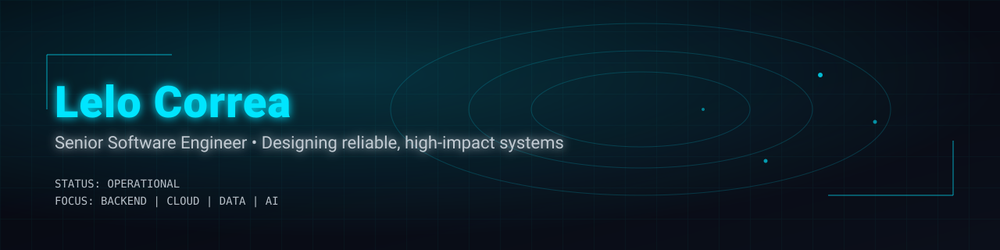



  
  <h3>Senior Software Engineer</h3>
  
Designing reliable, high-impact systems

  
  

---

## About Me
- Senior Software Engineer focused on backend architecture, reliability, and performance.
- Experienced in designing scalable APIs, data-intensive systems, and distributed services.
- Pragmatic, metrics-driven, and obsessed with delivery quality.

---

## Tech Stack

  

---

## GitHub Stats

  
  

  

---

## Focus Areas

  
  
  
  

---

## Connect

  <!-- TROQUE os links abaixo pelos seus -->
  
  
  

